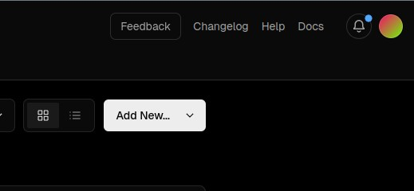

# Checkly Next.js Example


## Table of Contents

- [Intro](#intro)
- [Getting Started](#getting-started)
  - [Manual Setup](#manual-setup)
  - [Environment Variables](#environment-variables)
- [Checks](#checks)
  - [Configuration](#configuration)
  - [Browser](#browser)
- [Alerts](#alerts)
  - [Try to Fail!](#try-to-fail)
- [CI/CD](#cicd)
  - [Make](#make)
  - [GitHub Actions](#github-actions)
  - [Terraform](#terraform)
  - [Other Integrations](#other-integrations)
- [Special Thanks](#special-thanks)

## Intro

The purpose of this repository is to show an example application that utilizes [Checkly](https://checklyhq.com) for automated `Monitoring-as-Code`. While Checkly does offer the ability to interact with their service via their website, as an application grows, keeping code together becomes more important.

In this example, you will see how you can integrate [browser checks](https://www.checklyhq.com/docs/browser-checks/) directly into your code base, how to configure/receive alerts when a check has failed, as well as several examples of how to integrate your checks within a CI pipeline.

The scope of this project relative to all the possibilities as it comes to checks and integration is small. Hopefully, it opens up some ideas on how to integrate this awesome service into your code base. Don't hesitate to [check the docs](https://www.checklyhq.com/docs/browser-checks/) to learn about other checks, alerts, and CI integrations as well!

## Getting Started

First, clone the repo:

```bash
git clone https://github.com/jpal91/checkly-nextjs-example
```

After, you need to set up the project with the necessary dependencies.

This project comes with a `make` file that has several helper commands. If you have `make`, simply run:

```bash
make init
```

If you don't have `make` installed, navigate down to [Manual Setup](#manual-setup) and go from there.

> [!TIP]
>
> Run `make help` to see all commands

This command will walk you through installing all necessary project dependencies.

Once everything is installed, run:

```bash
pnpm dev # or npm run dev
```

This will start the development server at `localhost:3000`. Navigate to the browser and check it out!

The website is a simple example of a form with a little validation, and redirect on submit (the data doesn't actually go anywhere, though). Just enough to add some basic tests that we can use for this example.

Once you're done there, try out testing from the command line:

```bash
make test
# OR
pnpm exec checkly test
```

Then deploy your tests!

```bash
make deploy
# OR
pnpm exec checkly deploy
```

### Manual Setup

If you do not have `make` installed on your local computer, run the following instead:

```bash
git remote remove origin
cp .env.sample .env.local
pnpm install # or npm install if you prefer
pnpm add -g vercel
pnpm exec checkly login # or npx
vercel login
```

All `Next.js` dependencies will be installed which does also include the Checkly CLI as a dev dependency. The `vercel` CLI is added on to simulate manually deploying via the command line.

### Environment Variables

This repo comes with a [sample .env file](.env.sample) which shows the environment variables used in the project. Depending on what route(s) you take as it comes to testing/CI, you may need some (or maybe none) of these variables set.

> [!NOTE]
>
> An included `make` command in this repo, `sync-secrets` can help by adding all set variables in `.env.local` to Checkly.

A few notes on the variables -

1. **CHECKLY_API_KEY** and **CHECKLY_ACCOUNT_ID** - When logged in to Checkly via the command line, these will be included in the environment for you, so you can safely ignore setting them. However, if you want to try out the [Terraform](#terraform) or [GitHub](#github) implementations in this project, you will have to set them, as the building/testing will occur outside of your local environment.
2. **CHECKLY_ALERT\_\***\* - Any variables with `ALERT` refer to sensitive information that will be included in the environment to reference where to send alerts to (ie email addresses or phone numbers). See [Alerts](#alerts) for more details.
3. **ENVIRONMENT_URL** - Used by Checkly as the target for testing when running `npx checkly test` from the command line. When using `make vercel-build`, the `ENVIRONMENT_URL` will be automatically updated with the latest preview build's url from `vercel`. If using different means of interacting with this package, you'll want to explicitly state this or it will point to/test for the project's current url [https://checkly-nextjs-example.vercel.app](https://checkly-nextjs-example.vercel.app).
4. **VERCEL_BYPASS_TOKEN** - By default, Vercel will require a user visiting a page to be authenticated with Vercel. This will prevent CI tools (ie [GitHub Actions](#github-actions)) from being able to run tests on the site. **You can turn this functionality off in the project settings via the Vercel Dashboard**. Learn more about bypass protection [on the Vercel website](https://vercel.com/docs/security/deployment-protection/methods-to-bypass-deployment-protection/protection-bypass-automation).

> [!TIP]
>
> Notes have been added at the top of certain sections to provide hints for what env variables may be needed.

## Checks

The Checkly `playwright` tests and checks for this project reside in the [`__checks__`](./__checks__) directory of the repo. The configuration file can be found at the root, [`checkly.config.ts`](./checkly.config.ts).

Housing the files in `__checks__` is common practice, however, you can specify any place to put your checks by specifying a `glob` pattern in the `checkly.config.ts` like so:

```ts
// checkly.config.ts
export default defineConfig({
    ...
    tags: ["website", "api"],
    checkMatch: "**/__checks__/**/*.check.ts", // checkly cli looks for any checks here (could be browser, api, heartbeat, etc.)
    ignoreDirectoriesMatch: [
    ...
    browserChecks: {
      frequency: Frequency.EVERY_30M,
      testMatch: "**/__checks__/**/*.spec.ts", // also here for browser playwright tests
    },
    ...
})
```

Any new checks added to this directory will be automatically included when running Checkly tests/deploys.

### Configuration

In the configuration file you'll find several default values that will apply to checks unless otherwise specified (see [Browser](#browser) for details).

You can also add specific `playwright` configurations to the options as well. Not all options are supported though, see the page on [global configuration](https://www.checklyhq.com/docs/browser-checks/playwright-test/#global-configuration) for further details.

```ts
// checkly.config.ts
export default defineConfig({
	...
    playwrightConfig: {
      use: {
        baseURL:
          process.env.ENVIRONMENT_URL! ||
          "https://checkly-nextjs-example.vercel.app",
      },
    },
    browserChecks: {
      frequency: Frequency.EVERY_30M,
      testMatch: "**/__checks__/**/*.spec.ts",
    }
    ...
 })
```

For more details on the options you can pass in to the `config` visit the [Project Construct](https://www.checklyhq.com/docs/cli/constructs-reference/#project) page.

Having this file is **required** for the CLI to run properly, pick up tests within the repo, and deploy them to Checkly.

### Browser

The main checks for this project are in the [`browser.spec.ts`](./__checks__/browser.spec.ts) file with the check's configuration at [`browser.check.ts`](./__checks__/browser.check.ts).

The tests in `spec.ts` are relatively simple, just a quick demonstration of some `playwright` tests that would be picked up by the Checkly CLI.

The configuration in `check.ts` demonstrates how you can override specific variables named in the `checkly.config.ts` file. For example, the main `config` has browser checks running every 30 minutes, while the `browser.check` defines the frequency at every 10 minutes. This will be the final value as it is more targeted.

```ts
// __checks__/browser.check.ts
new BrowserCheck("browser-spec-ts", {
	...
	tags: ["website", "api"],
	frequency: Frequency.EVERY_10M,
	environmentVariables: [],
  ...
})
```

> [!NOTE]
>
> `check.ts` files are _not required_ for browser checks, but recommended. If not included for a specific test file, the defaults from `checkly.config.ts` will be used

## Alerts

Checkly has [several methods](https://www.checklyhq.com/docs/alerting-and-retries/alert-channels/) of sending alerts when something goes wrong. These can also be configured via JavaScript/TypeScript directly in your configuration. These alerts can also be defined on a global or per check basis as well.

Navigating to [`fail.check.ts`](./__checks__/fail/fail.check.ts), you can see an example of how alerts can be configured on a specific check:

```ts
// __checks__/fail/fail.check.ts
const sendDefaults = {
  sendFailure: true,
  sendRecovery: true,
  sendDegraded: false,
};
...
new BrowserCheck("fail-spec-ts", {
  ...
  code: {
    entrypoint: "./fail.spec.ts",
  },
  retryStrategy: RetryStrategyBuilder.noRetries(),
  alertChannels: [
    new SmsAlertChannel("sms-alert-1", {
      phoneNumber: process.env.CHECKLY_ALERT_PHONE_NUMBER!,
      ...sendDefaults,
    }),
  ],
});
```

Now because the global `checkly.config.ts` has `alertChannels` set for email and the `fail` check has channels set for SMS, which will a user receive? The answer is **JUST** a text message as that was the only one specified in the check. If you want to add emails on, you need to add the email construct to the check as well. However, if nothing was specified in the `fail.check.ts` for `alertChannels`, you would receive an email as that is the stated default from the `config`.

> [!NOTE]
>
> The [Construct Reference](https://www.checklyhq.com/docs/cli/constructs-reference/) guide can show you the specific arguments to pass into each check when writing the checks via JavaScript/TypeScript.

### Try to Fail!

> [!IMPORTANT]
>
> This section assumes you are logged in to Checkly and Vercel via the command line. You can do this manually through the dashboard as well by copying the `spec` code into a new check.
>
> Required env variables:
>
> 1. CHECKLY_ALERT_PHONE_NUMBER
> 2. CHECKLY_ALERT_EMAIL

How often do you get to break things on purpose? Well today you can!

If you're curious about what would happen if a test failed, you can deploy this check that will absolutely fail and you're guaranteed[^1] to receive alert.
[^1]: Well you should...

First a small change in `checkly.config.ts`:

```ts
export default defineConfig({
	...
	checkMatch: "**/__checks__/**/*.check.ts",
	ignoreDirectoriesMatch: [
		// Comment this next line out
		// "**/__checks__/fail/*,
	],
	...
})
```

This will make sure the `config` picks up this directory when deploying. Then run:

```bash
make trigger-fail

# OR

pnpm exec checkly deploy --force
# Wait about 10 seconds or so
sleep 10
# Clean up
pnpm exec checkly destroy --force
```

While `sleep` is running, you should notice that familiar buzz in your pocket. Try out some of the other options as well!

Finally, **remember to undo the comments!**

## CI/CD

This project features a few different examples and ways you can integrate Checkly directly from the command line. This goes from the simple(er) setup of using a command line tool like `make`, to integrating your app with third party providers like GitHub, and even adding `terraform`!

> [!NOTE]
>
> Keep in mind, the examples you see within are just that. These have not been heavily tested in a production environment and should serve more as _guides_ rather than production ready code.

### Make

> [!IMPORTANT]
>
> This section assumes you're logged in to Checkly and Vercel via CLI and won't work otherwise.
> Other than the [VERCEL_BYPASS_TOKEN](#environment-variables) (if applicable), all other variables are optional.

The [`Makefile`](./Makefile) in this repo shows an example of how you could run a basic CI process right from your local computer:

```makefile
# make vercel-deploy
vercel-deploy: vercel-build-prev vercel-deploy-prev
	@echo "\n---Running Checkly Tests---\n"
	$(call pm_exec,checkly test -r github --record -e ENVIRONMENT_URL=$(shell cat deployment-url.txt)) || exit 1
	vercel promote
	@echo "\n---Deploying to production---\n"
	$(call pm_exec,checkly deploy --force)


# Which expands to...

echo "\n---Building Preview---\n"
vercel build
echo "\n---Deploying to Vercel---\n"
vercel deploy --prebuilt > deployment-url.txt
echo "\n---Running Checkly Tests---\n"
pnpm exec checkly test -r github --record -e ENVIRONMENT_URL=** || exit 1
vercel promote
echo "\n---Deploying to production---\n"
pnpm exec checkly deploy --force
```

#### Steps

1. A preview build is initiated via `vercel build`.
2. The preview is deployed and the output value is the new preview's url that we will use as the `ENVIRONMENT_URL` to test with Checkly.
3. We initiate the check, adding the new `ENVIRONMENT_URL` as an argument.
4. If the test fails, we stop immediately. Since this is just a preview build, we don't have to worry about rolling anything back.
5. If successful, we promote the build to production, and deploy our checks to Checkly.

### GitHub Actions

> [!IMPORTANT]
>
> Required (in GitHub secrets):
>
> 1. CHECKLY_API_KEY
> 2. CHECKLY_ACCOUNT_ID
> 3. VERCEL_BYPASS_TOKEN (if applicable)

Using GitHub Actions you can automate you process so you won't have to run any other commands other than pushing your commits to your GitHub repo. The example included in this repo [`checkly.yml`](./.github/workflows/checkly.yml) follows the [example guide](https://www.checklyhq.com/docs/cicd/github-actions/) on the Checkly website fairly closely. So please feel free to check that page for additional reference.

A few things to note:

```yml
name: "checkly"
on: [deployment_status]
```

This action is making the assumption that your deployment is handled automatically by the [Vercel/GitHub Deployment](https://vercel.com/docs/deployments/git/vercel-for-github#configuring-for-github) integration, which is the recommended way to deploy a Vercel project.

> **Set Up Vercel Integration**
>
> Navigate to your [Vercel](https://vercel.com) account dashboard. You should see a button `Add New` near the top right.
>
> 
>
> Follow the instructions given to link your GitHub account with Vercel and select your repo from the given list.
>
> With this integration, every time you commit, Vercel will deploy a new build. By default, production builds on `main`, and preview builds on other branches.

When Vercel deploys, it sends a `deployment_status` event which will trigger this workflow. This allows us to check the deployment against our tests, and to deploy our checks if everything passes and if we're in production (ie pushing to `main`):

```yml
- name: Deploy checks # if the test run was successful and we are on Production, deploy the checks
  id: deploy-checks
  if: steps.run-checks.outcome == 'success' && github.event.deployment_status.environment == 'Production'
  run: pnpm exec checkly deploy --force
```

### Terraform

> [!IMPORTANT]
>
> Required:
>
> 1. CHECKLY_API_KEY
> 2. CHECKLY_ACCOUNT_ID
> 3. VERCEL_BYPASS_TOKEN (if applicable)

Although Terraform isn't strictly a `CI` tool, it can be used in conjunction with other tools to maintain the architecture of your application.

In [`main.tf`](./main.tf) you'll find an example of what this could look like with the Checkly Terraform integration:

```hcl

resource "checkly_check" "browser-check" {
  name      = "Checkly Next.js Example Browser Check"
  type      = "BROWSER"
  activated = true
  frequency = 10
  locations = [
    "us-east-1",
    "eu-west-1"
  ]

  alert_settings {
    escalation_type = "RUN_BASED"

    run_based_escalation {
      failed_run_threshold = 1
    }
  }

  alert_channel_subscription {
    channel_id = checkly_alert_channel.email_alert_1
    activated  = true
  }

  script = data.local_file.test_script.content
}
```

Defining checks in this way replaces the need for most of the `config` and check files in your repo. You could actually replace all of the `__checks__` folder by writing the script directly into the `tf` doc. Depending on how your project is set up, this could be beneficial as you could define your checks as a part of your infrastructure along with needed cloud services, web app servers, etc.

A simple `cli` example of how you could build and deploy all on the command line:

```bash
# Build and test
vercel build
url="${vercel deploy --prebuilt}"
pnpm exec checkly test -e ENVIRONMENT_URL=${url}

# Run terraform commands
terraform init
terraform plan
terraform apply

# Promote to production
vercel promote
```

### Other Integrations

Since Checkly can be interacted with via [API](https://developers.checklyhq.com/reference/), the possibilities are endless as it comes to CI options. Other examples that are not included in this repo are:

- [GitLab CI](https://www.checklyhq.com/docs/cicd/gitlabci/)
- [Jenkins](https://www.checklyhq.com/docs/cicd/jenkins/)
- [Vercel](https://www.checklyhq.com/docs/cicd/vercel/) (not cli)
- [GitHub Deployments](https://www.checklyhq.com/docs/cicd/github/)

## Special Thanks

- The team at [Checkly](https://checklyhq.com) for providing the service/documentation to make this repo possible.
- [StackEdit](https://stackedit.io/) for their awesome in-browser Markdown editor.
